# SO-101 Push-T Diffusion Policy

SO-101 형태의 로봇과 Push-T 조작 환경을 이용해 사람 시연 데이터를 수집하고, 동일한 데이터와 평가 조건에서 네 가지 imitation-learning policy를 비교한 재현 패키지입니다.

이 repository는 다음 내용을 제공합니다.

- 200개 human-demonstration episode와 고정된 train/validation split
- DP-CNN, DP-Transformer, IBC, LSTM-GMM 학습·평가 코드
- 동일한 100개 MuJoCo seed에서 수행한 정량 비교
- 모델별 대표 rollout과 성공·실패 영상
- 데이터·모델·runtime lineage 및 SHA-256 manifest
- 실제 SO-101 적용을 위한 sim-to-real 예비 연구 기록

## Research Question

> 동일한 SO-101 Push-T 시연 데이터와 평가 조건을 사용할 때, Diffusion Policy 계열과 IBC, LSTM-GMM은 성공률·정확도·실행 시간 측면에서 어떤 차이를 보이는가?

본 실험은 원 논문의 환경을 그대로 복제한 것이 아니라, dual-camera `224x224` 영상과 5차원 robot joint state를 사용하는 **source-faithful 3D robot adaptation**입니다.

## From the Original Paper to the SO-101 3D Adaptation

### Original Paper: Planar 2D Push-T

Diffusion Policy 논문의 simulated Push-T는 원형 end-effector가 평면 위에서 T block을 미는 2D manipulation benchmark입니다. Articulated robot arm이나 robot joint state 없이 planar pusher의 위치와 2-DoF action을 중심으로 policy를 학습합니다. Image-based configuration은 single-camera `96x96` observation을 사용합니다.

<p align="center">
  <a href="results/paper_reference/diffusion_policy_figure3_multimodal_behavior.svg">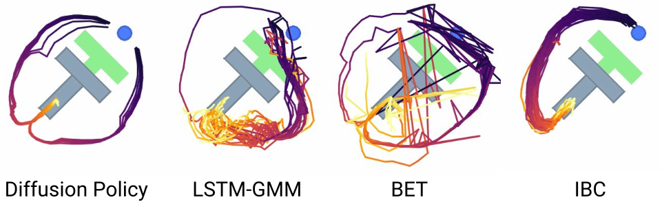</a><br>
  <sub>Diffusion Policy paper Figure 3 — Multimodal behavior in planar Push-T. Reproduced for attributed research comparison.</sub>
</p>

Figure 3은 같은 상태에서 pusher가 T block의 왼쪽 또는 오른쪽으로 이동할 수 있는 multimodal behavior를 보여줍니다. Diffusion Policy, LSTM-GMM, IBC, BET의 40-step rollout을 비교하며, Diffusion Policy가 여러 mode를 학습하면서 각 rollout에서는 하나의 mode에 일관되게 commit하는 특성을 설명합니다.

**Official sources**

- [Paper: Diffusion Policy, arXiv:2303.04137v5](https://arxiv.org/html/2303.04137)
- [Official project page](https://diffusion-policy.cs.columbia.edu/)
- [Official Push-T results](https://diffusion-policy.cs.columbia.edu/pusht_results.html)
- [Official DP-CNN Push-T video](https://diffusion-policy.cs.columbia.edu/videos/pusht_diffusion_video_wall.mp4)
- [Official DP-Transformer Push-T video](https://diffusion-policy.cs.columbia.edu/videos/pusht_diffusion_transformer_video_wall.mp4)

### This Project: 3D Articulated SO-101 Push-T

이 프로젝트에서는 같은 Push-T 연구 질문을 실제 robot embodiment에 더 가까운 형태로 확장했습니다. SO-101의 base, arm links, five joints, wrist와 gripper를 3D MuJoCo scene에 구성하고, top view와 side view에서 robot이 T block을 조작하도록 만들었습니다.

<p align="center">
  <a href="results/figures/so101_pusht_3d_simulation_environment.png">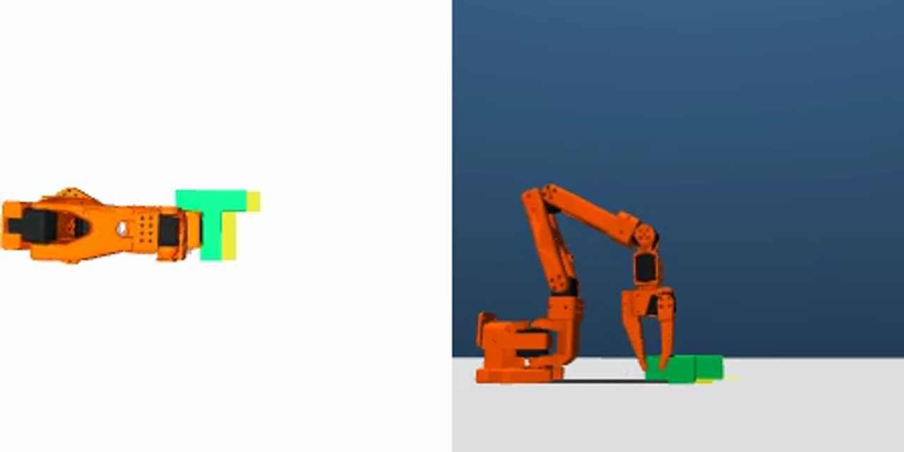</a><br>
  <sub>Actual DP-CNN rollout frame from this project — top view on the left and side view on the right.</sub>
</p>

| Component | Original Diffusion Policy Push-T | This SO-101 Project |
|---|---|---|
| Robot embodiment | Planar circular pusher | Articulated 3D SO-101 with five joints and gripper |
| Simulation scene | 2D planar pushing | 3D MuJoCo robot, table, T block, target and cameras |
| Visual observation | Single-camera 96x96 | Top + side dual-camera 224x224 |
| State input | Planar pusher position | `agent_pos[5]` robot joint state |
| Action | 2-DoF planar end-effector action | Comparable `float32[2]` absolute mocap XY contract |
| Demonstrations | Original benchmark dataset | 200 demonstrations collected and validated in this environment |
| Frame count | Original benchmark setting | 43,314 synchronized frames |
| Model comparison | Diffusion Policy and prior baselines | DP-CNN, DP-Transformer, IBC and LSTM-GMM |
| Evaluation | Planar Push-T rollout | 3D SO-101 simulation over the same 100 environment seeds |
| Best result here | Not directly comparable | DP-CNN: 92/100 successful rollouts |

### What Was Implemented in This Project

이 repository의 핵심 기여는 기존 학습 script를 단순 실행한 것이 아닙니다.

1. **3D SO-101 MuJoCo Environment** — SO-101 body, joint, gripper, table, T block, target와 camera를 포함한 simulation scene을 구축했습니다.
2. **Robot-State Observation** — planar pusher state 대신 실제 robot 구조를 반영하는 `agent_pos[5]` joint-state pipeline을 구현했습니다.
3. **Dual-Camera Observation** — top/side `224x224` RGB frame을 동기화해 각 model의 image encoder에 연결했습니다.
4. **Human Demonstration Collection** — F710 조작, episode state machine, validation, atomic publish와 dashboard를 구현해 200개 시연을 수집했습니다.
5. **Canonical Dataset** — 43,314 frame, 180/20 episode split, normalization statistics와 SHA-256 lineage를 고정했습니다.
6. **Four-Model Adaptation** — official DP-CNN, DP-Transformer, IBC-DFO, LSTM-GMM implementation을 동일 observation/action contract에 연결했습니다.
7. **Common Evaluation** — 동일한 100개 seed, 최대 300 step, 동일 success/terminal-error metric으로 비교했습니다.
8. **Reproducibility Package** — checkpoint metadata, runtime lock, bundle identity, figures, videos와 manifest를 하나의 handoff package로 정리했습니다.

### Resulting Contribution

> 이 연구는 논문의 planar 2D Push-T를 그대로 재실행한 것이 아니라, Push-T policy learning을 **3D articulated SO-101 robot, dual-camera vision, five-joint robot state와 직접 수집한 200개 demonstration**으로 확장한 연구입니다. 직접 구축한 simulation·data·training·evaluation pipeline에서 DP-CNN이 100개 rollout 중 92개를 성공했습니다.

### Video Comparison

| Original Paper / Project | This Project |
|---|---|
| [Official DP-CNN Push-T video](https://diffusion-policy.cs.columbia.edu/videos/pusht_diffusion_video_wall.mp4) | [SO-101 DP-CNN three-view success GIF](results/videos/previews/DP_CNN_representative_preview.gif) |
| [Official DP-Transformer Push-T video](https://diffusion-policy.cs.columbia.edu/videos/pusht_diffusion_transformer_video_wall.mp4) | [SO-101 DP-Transformer three-view success GIF](results/videos/previews/DP_Transformer_representative_preview.gif) |
| [Official Push-T results page](https://diffusion-policy.cs.columbia.edu/pusht_results.html) | [SO-101 simulation asset manifest](results/ASSET_MANIFEST.md) |

## End-to-End Pipeline

Mermaid 축소 그림 대신 각 단계의 입력과 산출물을 텍스트로 정리했습니다.

### 1. Human Demonstration Collection

Logitech F710으로 MuJoCo의 SO-101 end-effector를 조작해 T block을 목표 pose로 이동시킵니다. 각 episode에는 상단·측면 영상, 다섯 관절 상태, 평면 절대 목표 행동을 10 Hz로 저장합니다.

### 2. Episode Validation and Curation

Camera frame 수, state/action 길이, timestamp, 수치 유효성, unsolved-to-solved 전환을 검사합니다. 검증을 통과한 episode만 canonical dataset에 포함합니다.

### 3. Canonical 200-Episode Dataset

검증된 200개 episode, 총 43,314 frame을 하나의 native store로 병합합니다. Train 180개와 validation 20개를 episode 단위로 고정하고 dataset·split digest를 생성합니다.

### 4. Four-Policy Training

동일 dataset과 split을 사용해 다음 모델을 각각 학습합니다.

- Diffusion Policy CNN (`DiffusionUnetHybridImagePolicy`)
- Diffusion Policy Transformer (`DiffusionTransformerHybridImagePolicy`)
- Implicit Behavioral Cloning (`IbcDfoHybridImagePolicy`)
- LSTM-GMM (`BC_RNN_GMM` / `RNNGMMActorNetwork`)

### 5. Inference Bundle Export

각 checkpoint에 normalizer, resolved config, dataset/split identity, policy class를 결합해 inference bundle을 생성합니다. 모델 결과를 다른 dataset이나 runtime과 혼동하지 않도록 SHA-256 lineage를 함께 저장합니다.

### 6. Common Simulation Evaluation

각 모델을 MuJoCo seed `100000..100099`에서 최대 300 step 동안 평가합니다. Success rate, terminal position error, terminal yaw error, duration과 failure trace를 기록합니다.

### 7. Comparative Analysis and Future Work

네 모델의 정량 성능, 대표 trajectory, 성공·실패 rollout을 비교합니다. Simulation 결과를 바탕으로 sim-to-real transfer와 real-world demonstration 학습을 다음 연구 단계로 확장합니다.

## Data Contract

| 항목 | 형식 |
|---|---|
| Top camera | `uint8[224,224,3]` |
| Side camera | `uint8[224,224,3]` |
| Robot state | `float32[5]` |
| Joint order | Rotation, Pitch, Elbow, Wrist Pitch, Wrist Roll |
| Action | `float32[2]`, absolute mocap XY |
| Action range | `[-1,1]^2` |
| Frequency | 10 Hz |
| Dataset | 200 episodes / 43,314 frames |
| Split | train 180 / validation 20 |

## Simulation Results

모든 모델은 동일한 100개 environment seed와 최대 300-step 조건에서 평가했습니다.

| Policy | Training updates | Success rate | Mean terminal dxy | Mean terminal dyaw | Mean duration |
|---|---:|---:|---:|---:|---:|
| **DP-CNN** | 400,000 | **92%** | **0.01895 m** | **4.37 deg** | **11.96 s** |
| DP-Transformer | 400,000 | 82% | 0.01950 m | 6.65 deg | 14.65 s |
| IBC | 100,000 | 6% | 0.03880 m | 26.58 deg | 28.68 s |
| LSTM-GMM | 300,000 | 4% | 0.04355 m | 25.73 deg | 28.80 s |

DP-CNN이 가장 높은 성공률과 가장 작은 평균 위치·회전 오차를 기록했습니다. DP-Transformer도 높은 성공률을 보였지만 평균 수행 시간이 더 길었습니다. IBC와 LSTM-GMM은 현재 observation/action adaptation에서 목표 pose 정렬에 어려움을 보였습니다.

상세 결과: [`evaluation/four_model_comparison.md`](evaluation/four_model_comparison.md)

<p align="center"><a href="results/figures/four_model_simulation_comparison.png">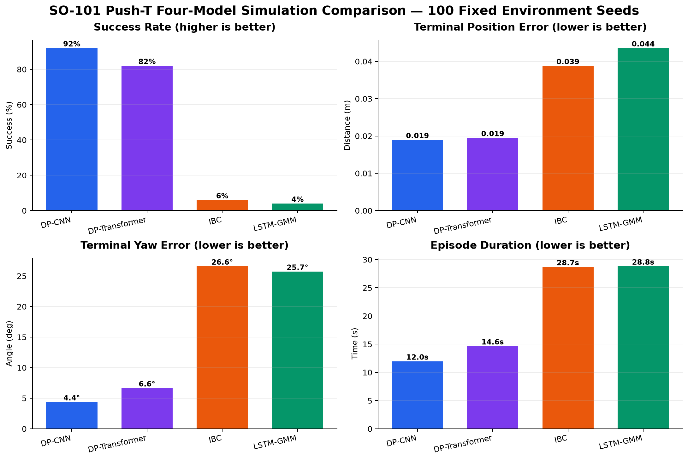</a><br><sub>All four policies evaluated over the same 100 fixed environment seeds.</sub></p>

## Four-Model Rollout Previews

DP-CNN과 DP-Transformer는 synchronized three-view success reel, IBC와 LSTM-GMM은 synchronized three-view failure reel을 사용했습니다. Dark title card를 제거한 뒤 동일하게 64 frame, 8 fps, `800x450` wide canvas로 변환했습니다. 각 GIF는 large 3D rollout, top policy camera, 2D block-state trajectory를 동시에 보여줍니다.

### DP-CNN — 92% Success (Success Rollout)

<p align="center">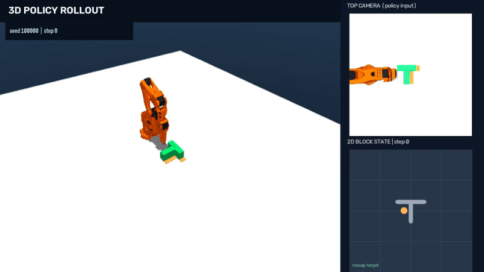</p>

### DP-Transformer — 82% Success (Success Rollout)

<p align="center"></p>

### IBC — 6% Success (Failure Rollout)

<p align="center">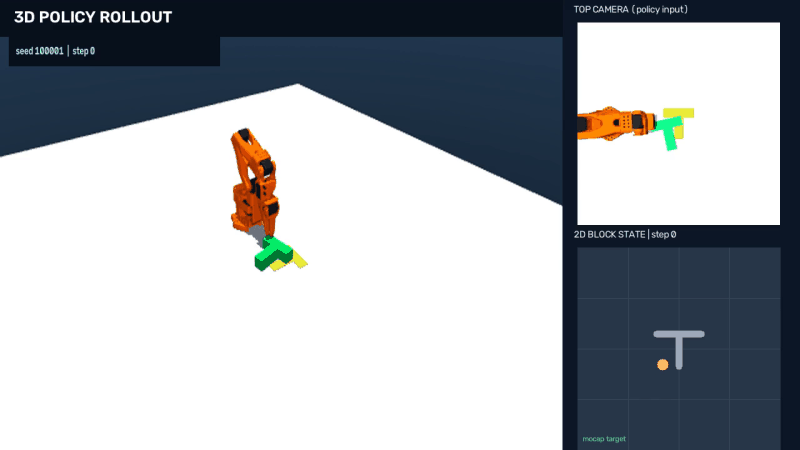</p>

### LSTM-GMM — 4% Success (Failure Rollout)

<p align="center">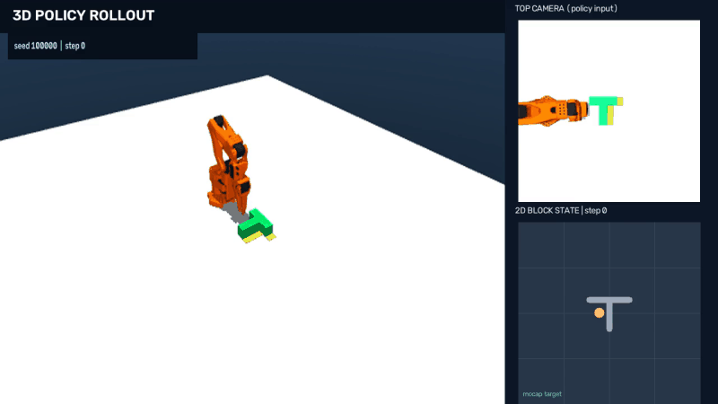</p>

## Additional Diagnostics

<details>
<summary><strong>DP-Transformer multimodal and 100-seed diagnostics</strong></summary>
<br>
<table>
<tr>
<td width="50%" align="center"><a href="results/figures/DP_Transformer_multimodal_40rollouts.png">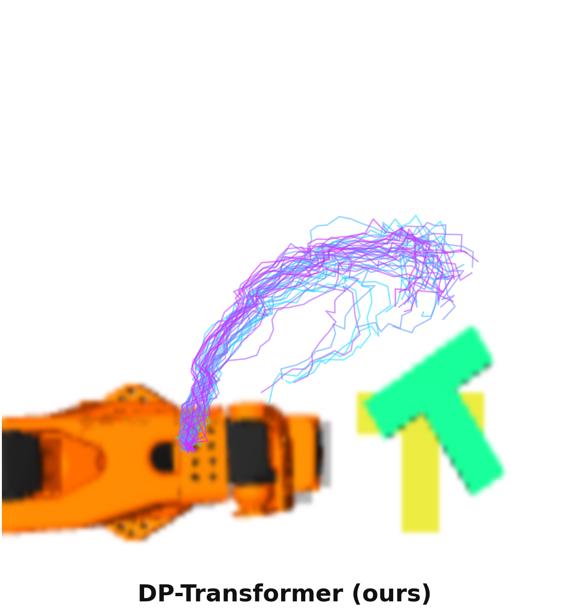</a><br><sub>40 stochastic rollouts from one initial state</sub></td>
<td width="50%" align="center"><a href="results/figures/DP_Transformer_100seed_benchmark.png">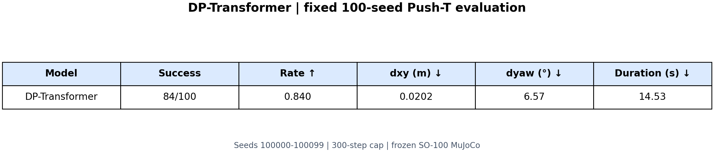</a><br><sub>100-seed terminal outcomes</sub></td>
</tr>
</table>
</details>

### Physical Registration Summary

<table>
<tr>
<td width="33%" align="center"><a href="results/figures/joint_fk_15poses.png">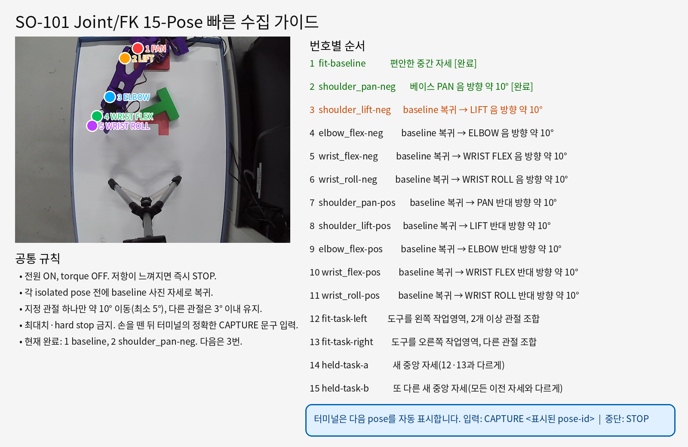</a><br><sub>Joint/FK</sub></td>
<td width="33%" align="center"><a href="results/figures/camera_registration_fit.png">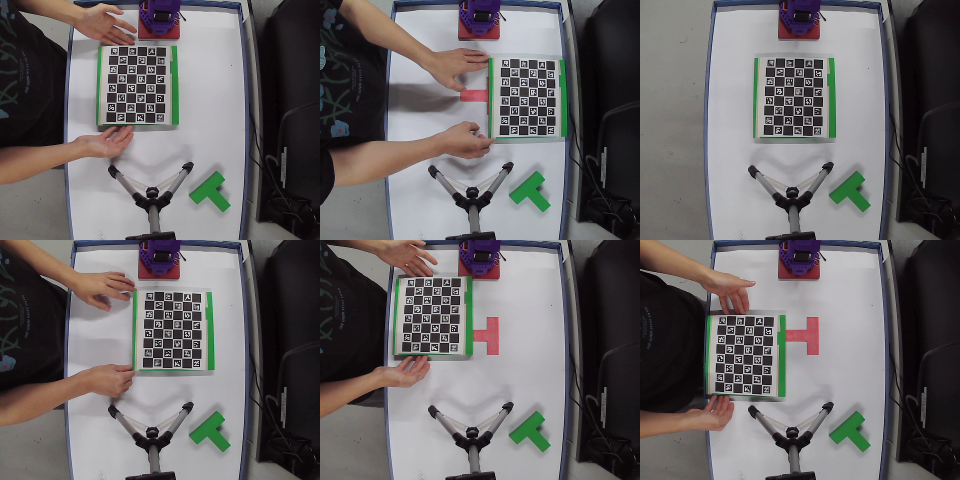</a><br><sub>Camera fit</sub></td>
<td width="33%" align="center"><a href="results/figures/camera_registration_heldout.png">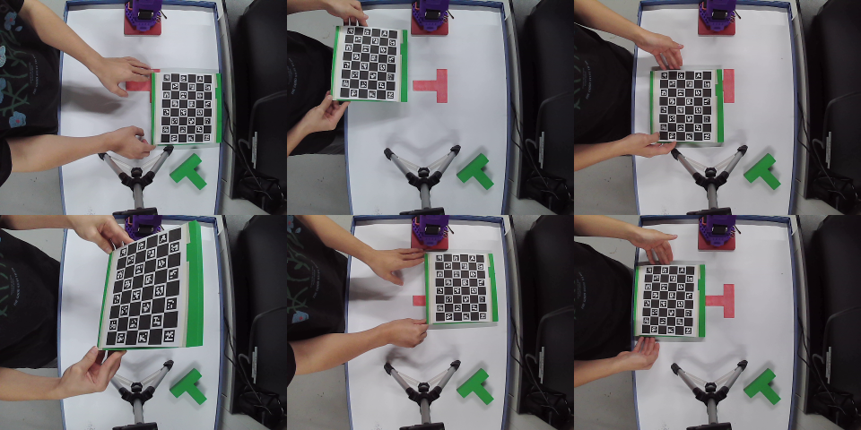</a><br><sub>Held-out view</sub></td>
</tr>
</table>

## Reproduction

### 1. Package Verification

```bash
bash docs/verify_package.sh
bash docs/run_non_hardware_checks.sh
```

대형 dataset과 checkpoint는 GitHub에 포함하지 않습니다. [`docs/ARTIFACT_STORAGE.md`](docs/ARTIFACT_STORAGE.md)의 경로에 NAS artifact를 복원한 뒤 checksum을 검사합니다.

### 2. Model Smoke Test and Training

```bash
./training/model_smoke.sh dp_cnn
./training/train_model.sh dp_cnn
./training/train_model.sh dp_transformer
./training/train_model.sh ibc
./training/train_model.sh lstm_gmm
```

### 3. Simulation Rollout

```bash
./simulation/verify_environment.sh
./simulation/rollout_policy.sh dp_cnn
./simulation/rollout_policy.sh dp_transformer
./simulation/rollout_policy.sh ibc
./simulation/rollout_policy.sh lstm_gmm
```

## Repository Structure

| Directory | Contents |
|---|---|
| `docs` | 환경·검증·artifact 복원·실험 분석 문서 |
| `src` | Python package, scripts, tests, runtime lock |
| `data/collection` | F710 시연 수집 절차 |
| `data/datasets` | Dataset card, split, manifest |
| `simulation` | MuJoCo 검증과 policy rollout |
| `05_references` | Lineage-compatible pinned external runtime path |
| `training` | 네 모델 smoke·training wrapper |
| `models` | Bundle metadata, normalizer, training receipt |
| `evaluation` | 100-seed 비교 결과 |
| `sim_to_real` | 실제 입력 정합과 예비 transfer evidence |
| `results` | Figure와 rollout video |
| `third_party` | 외부 dependency와 license |
| `integrity` | SHA-256 manifest와 verification receipt |

## Limitations and Future Work

### 1. Simulation Benchmark Limitations

- 원 논문의 single-camera 96x96 Push-T와 달리 dual-camera 224x224, `agent_pos[5]`를 사용한 adaptation입니다.
- 모델별 optimizer update와 계산량이 동일하지 않으므로 성공률만으로 알고리즘의 절대적 우월성을 주장할 수 없습니다.
- 현재 결과는 training seed 1개와 environment seed 100개에 기반합니다. 여러 training seed의 평균·표준편차와 confidence interval이 추가로 필요합니다.
- IBC와 LSTM-GMM의 낮은 성공률은 알고리즘 자체뿐 아니라 observation/action adaptation과 hyperparameter의 영향을 함께 받습니다.

### 2. Sim-to-Real Transfer

Simulation에서 학습한 DP-CNN을 실제 SO-101에 연결하는 예비 시도를 수행했지만, 2차원 pusher action을 5-DOF robot trajectory로 변환하는 과정에는 추가 연구가 필요합니다.

후속 단계는 다음과 같습니다.

1. Virtual pusher와 실제 robot tool의 collision geometry를 분리합니다.
2. Tool-tip의 의도된 T-block contact와 위험한 arm/self/table collision을 구분합니다.
3. 단순 joint 직선 보간 대신 lift-translate-descend waypoint planner를 사용합니다.
4. Fresh camera observation마다 작은 action만 실행하는 receding-horizon control을 적용합니다.
5. Motor write가 없는 shadow evaluation을 반복한 뒤 제한된 physical single-step으로 확장합니다.
6. 조명, camera pose, 마찰, backlash와 joint calibration 변화에 대한 domain-gap robustness를 평가합니다.

기술적 분석은 [`docs/SIM_TO_REAL_FINAL_2026-08-27.md`](docs/SIM_TO_REAL_FINAL_2026-08-27.md)에 정리되어 있습니다.

### 3. Real-World Demonstration Learning

Simulation policy를 변환하는 방법과 별도로, 실제 SO-101에서 demonstration을 새로 수집하고 학습하는 실험이 필요합니다.

1. 실제 top/side camera, joint state, operator action을 동기화해 안전한 real-world dataset을 구축합니다.
2. 다양한 T-block 초기 위치·회전, 조명, 마찰과 배경 조건을 포함합니다.
3. Simulation dataset만 사용한 policy, real dataset만 사용한 policy, simulation pretraining 후 real fine-tuning한 policy를 비교합니다.
4. 실제 데이터의 action representation을 Cartesian delta 또는 joint-space command 중 하나로 명확히 고정합니다.
5. Train/validation/test session을 날짜·장면 단위로 분리해 leakage를 방지합니다.
6. 실제 robot success rate뿐 아니라 contact force proxy, emergency stop, path clearance, completion time을 함께 평가합니다.

### 4. Additional Experiments

- 50/100/200 episode data-size ablation
- Single-camera와 dual-camera 비교
- Training seed 3개 이상의 반복 실험
- 실패 유형별 정량 분석과 hard-seed curriculum
- Depth/3D observation 확장
- Domain randomization과 real-image fine-tuning 비교

## Documentation

- [200ep 네 모델 실험 설계](docs/EXPERIMENT_SUMMARY.md)
- [Simulation 평가 비교](evaluation/four_model_comparison.md)
- [Sim-to-real 기술적 분석](docs/SIM_TO_REAL_FINAL_2026-08-27.md)
- [Dataset card](data/datasets/DATASET_CARD.md)
- [Artifact 저장·복원](docs/ARTIFACT_STORAGE.md)
- [Third-party notices](third_party/THIRD_PARTY_NOTICES.md)
