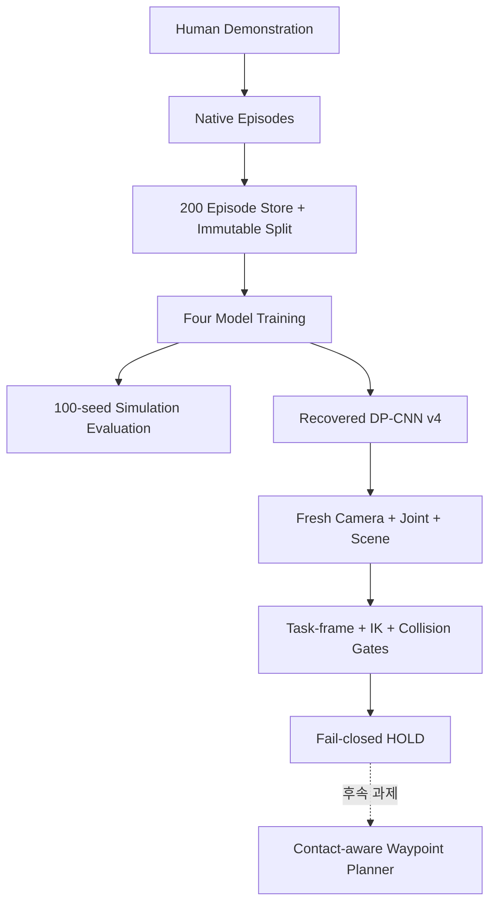

# 시스템 개요

## 연구 목표

SO-101 Push-T에서 동일한 200-episode 데이터로 네 모방학습 정책을 학습하고 고정 MuJoCo 조건에서 비교했다. 별도 physical diagnostic control plane에서 recovered DP-CNN을 실제 camera/joint/scene 입력에 연결했으나, 안전한 IK/collision path를 증명하지 못해 motor write 없이 종료했다.

## 최종 범위

| 구성요소 | 상태 |
|---|---|
| 200ep dataset + split | 완료, manifest/checksum 고정 |
| DP-CNN / DP-Transformer / IBC / LSTM-GMM | 학습·simulation 평가 완료 |
| 네 checkpoint와 bundle | NAS checksum 보존 |
| Recovered DP-CNN v4 | authentic class load/inference 확인 |
| Joint/FK + camera registration | 확인 |
| Production shadow | fail-closed HOLD, 0 cycle |
| Physical actuation | 수행하지 않음 |

## 데이터 흐름

## 안전 경계

- Simulation 학습·평가 identity에는 hardware 제어 권한이 없다.
- Production shadow receipt는 `cycles_completed=0`, `motor_writes_performed=false`, `terminal_state=HOLD`를 고정한다.
- Authorization과 ARMED terminal은 발급되지 않았다.
- 종료 시 여섯 motor의 torque가 모두 disabled임을 확인했다.
- Collision/branch 기준을 낮추거나 다른 checkpoint로 fallback하지 않았다.

상세 원인은 [`../docs/SIM_TO_REAL_FINAL_2026-08-27.md`](../docs/SIM_TO_REAL_FINAL_2026-08-27.md)를 참조한다.
